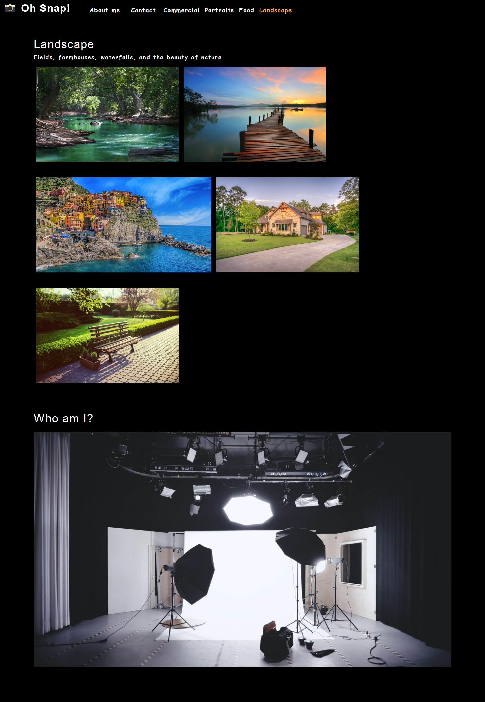

# Photo Portfolio for Lyza
<a href='https://opensource.org/licenses/MIT'></a>
  
## Table of Contents
[Description](#Description) 
[Usage](#Usage) 
[License](#License) 
[Questions](#Questions)

## Description
This Portfolio was created for a customer called Lyza using React. 

## Usage
Upon opening the website on a browser, the user can check some of Lyza's pictures.
 
 
The portfolio can be accessed through by through here: https://padredilg.github.io/photo-port/
</img>

## License
This application is covered under the <a href='https://opensource.org/licenses/MIT'>MIT License</a>

## Questions
<a href='https://github.com/Padredilg'>Padredilg</a> 
If you have any questions, you may email at padredilg@gmail.com